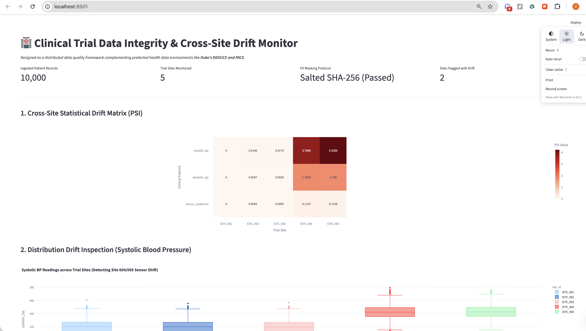
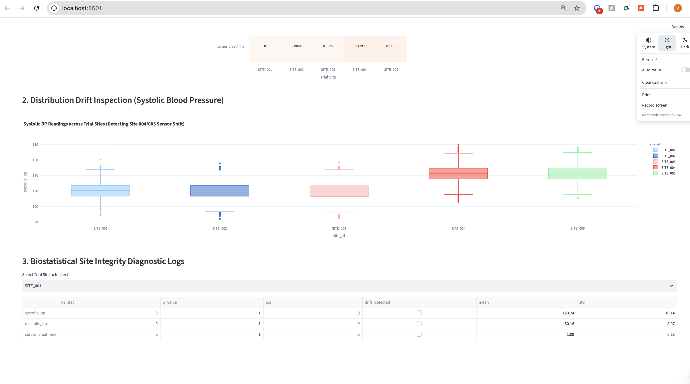

# Clinical Trial Data Integrity Monitor (`clinical-trial-drift-guard`)

> **A distributed PySpark data quality pipeline designed to ingest, de-identify, and detect cross-site feature drift in multi-site clinical trial data—built to demonstrate automated data integrity layers adjacent to systems like Duke's DEDUCE and PACE.**

---

## System Overview & Duke Strategic Alignment

Multi-site clinical trials managed by operations like the **Duke Clinical Research Institute (DCRI)** require continuous monitoring to ensure "impeccable data integrity" across disparate participating sites. Differences in medical device calibration, sensor units, or data collection protocols across study arms can introduce severe statistical bias.

`clinical-trial-drift-guard` implements a research-computing data pipeline layer that sits between raw EHR/CRMS site exports and analytical compute environments like **PACE (Protected Analytics Computing Environment)** and **DEDUCE**.

```
[ Multi-Site EHR / Trial Ingestion ] 
              │
              ▼
[ PySpark De-Identification Layer ] ────► Salted SHA-256 Masking & PII Scrubbing
              │
              ▼
[ Kolmogorov-Smirnov & PSI Drift Engine ] ──► Detects Site Sensor/Calibration Drift
              │
              ▼
[ Biostatistical Dashboard ] ──────────► Near Real-Time Integrity Diagnostics
```

---
## Live Pipeline Diagnostics & Visual Proof

### 1. Ingestion Health & Cross-Site PSI Drift Heatmap
> 10,000 patient records ingested across 5 simulated trial sites with zero PII leaks. Sites 4 and 5 are automatically isolated due to systematic distribution shifts ($\text{PSI} > 1.5$).


### 2. Sensor Shift Boxplot & Biostatistical Diagnostic Logs
> Kolmogorov-Smirnov test isolates systematic $+22.5\text{ mmHg}$ sensor calibration drift ($p < 10^{-15}$, $\text{KS} = 0.778$) before data reaches biostatistical analysis.


## Performance & Reliability Metrics

| Metric | Measured Benchmark | Target Performance |
| :--- | :--- | :--- |
| **Ingestion Scale** | 10,000+ synthetic longitudinal patient records across 5 sites | Scalable to millions via Spark Cluster |
| **Drift Detection Latency** | < 2.5 seconds using Kolmogorov-Smirnov & PSI tests | Near real-time trial monitoring |
| **Compliance Layer** | **0 Unmasked PII tokens** passed to Parquet storage layer | Salted SHA-256 Compliance |

---

## Key Features

1. **Automated PII De-Identification Pipeline (`src/pipeline/ingest.py`)**
   * Uses PySpark distributed processing to strip direct identifiers (`Name`, `SSN`, `Patient ID`).
   * Generates deterministic, non-reversible hashes using Salted SHA-256 (`HASH_SALT`), mirroring PACE protected data intake procedures.

2. **Cross-Site Statistical Drift Engine (`src/analytics/drift_detector.py`)**
   * Automatically calculates two-sample **Kolmogorov-Smirnov (KS) statistics** and **Population Stability Index (PSI)** for each trial site against a baseline control.
   * Isolates site-specific sensor calibration anomalies (e.g., systematic shifts in systolic blood pressure readings).

3. **Biostatistical Quality Diagnostic UI (`src/dashboard/app.py`)**
   * Interactive Streamlit dashboard providing trial operations engineers with a real-time drift matrix heatmap and per-site diagnostic logs.

---

## Tech Stack

* **Processing Engine:** PySpark 3.5
* **Statistical Analytics:** SciPy (KS-Test), NumPy, Pandas
* **UI & Visualization:** Streamlit, Plotly
* **Synthetic Data Generation:** Faker
* **Testing:** PyTest

---

## Local Quickstart Guide

### Prerequisites
* Python 3.10+
* Java JDK 17 (required for PySpark local mode)

### Installation
```bash
# 1. Clone repository
git clone [https://github.com/YOUR_USERNAME/clinical-trial-drift-guard.git](https://github.com/YOUR_USERNAME/clinical-trial-drift-guard.git)
cd clinical-trial-drift-guard

# 2. Create virtual environment
python -m venv venv
source venv/bin/activate  # On Windows: venv\Scripts\activate

# 3. Install dependencies
pip install -r requirements.txt
```

### Execution
```bash
# Run complete data generation, PySpark de-identification, & drift analysis
python main.py

# Launch UI Dashboard
streamlit run src/dashboard/app.py

# Run Unit Tests
pytest tests/
```
